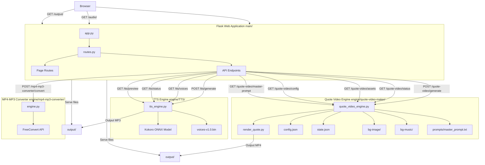
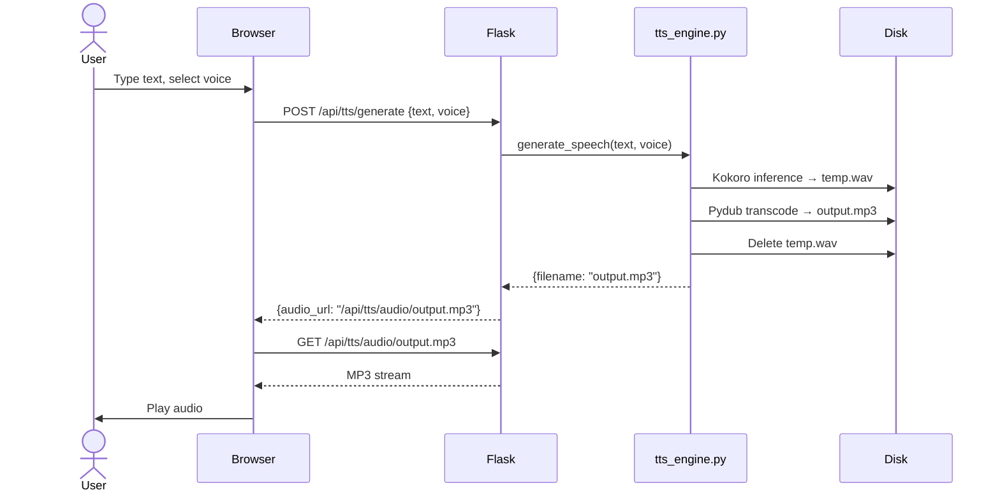
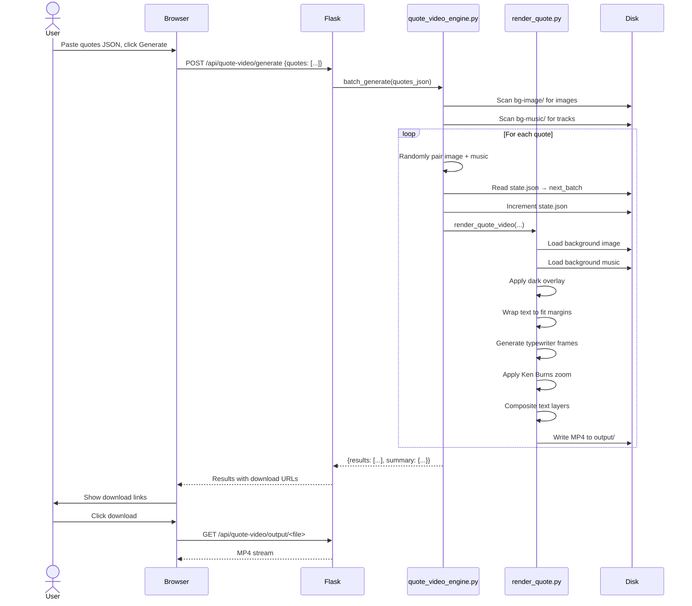
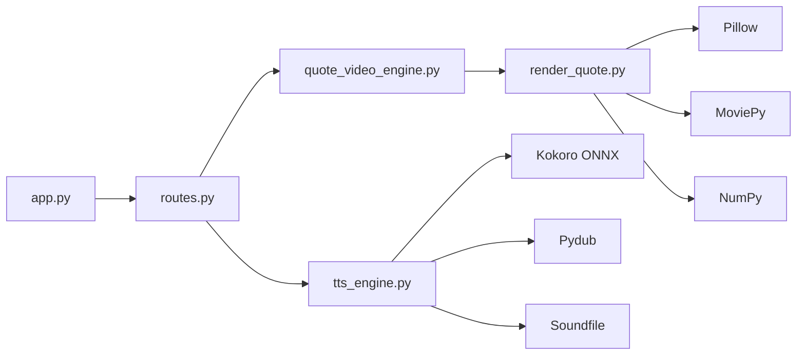

# Data Flow & Architecture

## System Diagram



## End-to-End Flows

### TTS Generation Flow



### Quote Video Generation Flow



## Component Dependency Graph



## File System Layout

```
engine/
├── TTS/
│   ├── tts_engine.py            # ← Core logic
│   ├── kokoro-v1.0.onnx        # ONNX model (~310 MB, gitignored)
│   ├── voices-v1.0.bin         # Voice pack (gitignored)
│   ├── voice-sample/            # Pre-generated preview MP3s (54 files)
│   └── output/                  # Generated MP3s
│
└── quote-video-maker/
    ├── __init__.py              # Package init
    ├── render_quote.py          # ← Video rendering
    ├── quote_video_engine.py    # ← Orchestration
    ├── config.json              # ← Rendering params
    ├── state.json               # ← Batch counter
    ├── state.example.json       # Example state file
    ├── prompts/
    │   └── master_prompt.txt
    ├── bg-image/                # Background images (add yours)
    ├── bg-music/                # Background tracks (add yours)
    ├── output/                  # Generated MP4s
    └── yt-files/                # YouTube export files

main/
├── app.py                      # Flask entry point
├── routes.py                   # All HTTP routes & API
├── requirements.txt
├── static/
│   ├── style.css               # 826 lines of styling
│   └── js/
│       └── project_activation.js
└── templates/
    ├── _base.html              # Base layout (sidebar, content, bot console)
    ├── index.html              # Overview landing page
    ├── tts.html                # TTS interface
    ├── quote-video.html        # Quote video interface
    └── _partials/              # Reusable template fragments
        ├── bot_panel.html
        ├── project_content.html
        └── project_header.html
```

## Key Design Decisions

| Decision | Rationale |
|---|---|
| **No database** | Everything is file-system based — JSON state, flat file assets, output on disk. Simple, portable, no infra. |
| **Sys.path injection** | Engine dirs added to `sys.path` in both `app.py` and `routes.py` — allows standalone imports. |
| **New Kokoro instance per call** | Avoids model sharing issues between requests, at the cost of reloading the model each time. |
| **Single-threaded rendering** | No concurrency protection on `state.json` — relies on Flask's default single-thread behavior. |
| **Vanilla JS frontend** | No framework dependencies. Keeps the UI layer minimal and zero-build. |
| **Modular templates** | Reusable `_partials/` fragments reduce duplication across pages. |

## Related

- [[mp4-mp3-converter|MP4 to MP3 Converter]]
- [[automations-home|Home]]
- [[main-app-flask|Main App (Flask)]]
- [[tts-engine|TTS Engine]]
- [[quote-video-engine|Quote Video Engine]]
- [[orchestration-layer|Orchestration Layer]]
- [[frontend-ui|Frontend & UI]]
